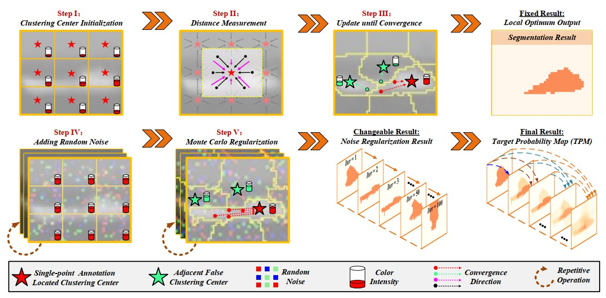
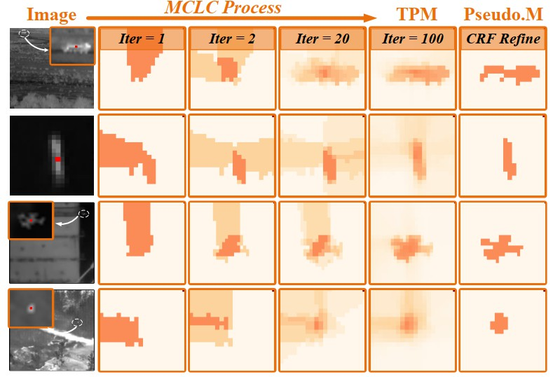

# Infrared-small-target-detection-with-single-point-supervision
<br>

## Our paper has been accepted by `IEEE ICCV-2023`. Our team will release more interesting works and applications on SIRST soon. Please keep following our repository.



## Algorithm Introduction

Monte Carlo Linear Clustering with Single-Point Supervision is Enough for Infrared Small Target Detection, Boyang Li, Chao Xiao, Longguang Wang, and Yingqian Wang, ICCV 2023 [[Paper]](https://openaccess.thecvf.com/content/ICCV2023/papers/Li_Monte_Carlo_Linear_Clustering_with_Single-Point_Supervision_is_Enough_for_ICCV_2023_paper.pdf)

We propose a Monte Carlo linear clustering (MCLC) method to acheive high-performance infrared small target segmentation with only single point annotation. Experimental results on several datasets (e.g., NUAA, NUDT, IRSTD-1K, and NUDT-Sea) verify the effectiveness of our method. The contribution of this paper are as follows:

1. We propose the first single point supervised method to achieve SIRST detection.

2. Inspired by the inherent characteristic of SIRST, a simple yet effective linear clustering approach with random noise-guided Monte Carlo regularization is proposed to coarsely extract and further refine the candidate target region.

3. Ablation study reveals that pixel-level labels are not necessary for SIRST detection while single-point supervision is strong enough.



## Citation

If you find the code useful, please consider citing our paper using the following BibTeX entry.

```
@inproceedings{li2023monte,
  title={Monte Carlo linear clustering with single-point supervision is enough for infrared small target detection},
  author={Li, Boyang and Wang, Yingqian and Wang, Longguang and Zhang, Fei and Liu, Ting and Lin, Zaiping and An, Wei and Guo, Yulan},
  booktitle={Proceedings of the IEEE/CVF International Conference on Computer Vision},
  pages={1009--1019},
  year={2023}
}
```

## Prerequisite
* Tested on Ubuntu 16.04, with Python 3.7, PyTorch 1.7, Torchvision 0.8.1, CUDA 11.1, and 1x NVIDIA 3090 and also 

* Tested on Windows 10  , with Python 3.6, PyTorch 1.1, Torchvision 0.3.0, CUDA 10.0, and 1x NVIDIA 1080Ti.

* [The NUDT-SIRST download dir](https://pan.baidu.com/s/1WdA_yOHDnIiyj4C9SbW_Kg?pwd=nudt) (Extraction Code: nudt)

* [The NUAA-SIRST download dir](https://github.com/YimianDai/sirst) [[ACM]](https://arxiv.org/pdf/2009.14530.pdf)

* [The NUST-SIRST download dir](https://github.com/wanghuanphd/MDvsFA_cGAN) [[MDvsFA]](https://openaccess.thecvf.com/content_ICCV_2019/papers/Wang_Miss_Detection_vs._False_Alarm_Adversarial_Learning_for_Small_Object_ICCV_2019_paper.pdf)

## Usage

#### 1. Preprocessing.

```bash
python generate_single_point_Prior.py

```
#### 2. Pseudo Label Generation.

```bash
python Baseline_NUAA.py
```

#### 3. Retrain SIRST Detection Network (e.g, DNANet) with the Generated Label.
